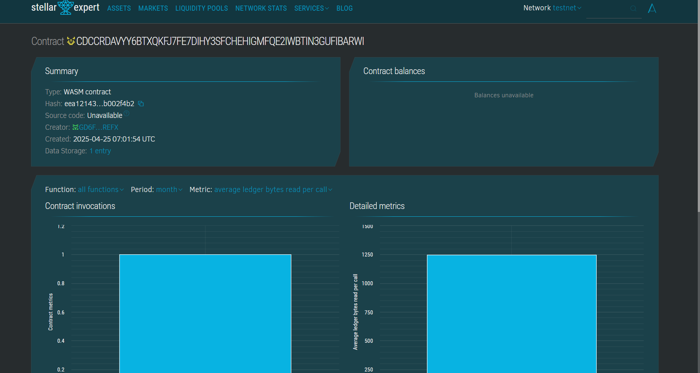

# E-Book Publishing Platform

## Project Description
A decentralized platform enabling authors to publish their e-books securely and transparently on the blockchain. The smart contract allows book registration, publishing, and viewing — all managed in a tamper-proof manner.

## Project Vision
Empower authors to self-publish digital content with full ownership and transparency using blockchain technology, while ensuring immutable recordkeeping for each book entry.

## Key Features
- *Book Registration*: Add a new book with title and author.
- *Book Publishing*: Change the status of a book to published.
- *View Book*: Retrieve book information using its ID.
- *Immutable Record*: All entries are securely stored on-chain.

## Future Scope
- Add user roles (author, reader, admin)
- Royalty tracking and payments for authors
- Rating and review system for readers
- Integration with IPFS for decentralized e-book storage
- Book licensing and DRM on-chain

## CONTRACT DETAIL 
CDCCRDAVYY6BTXQKFJ7FE7DIHY3SFCHEHIGMFQE2IWBTIN3GUFIBARWI 
